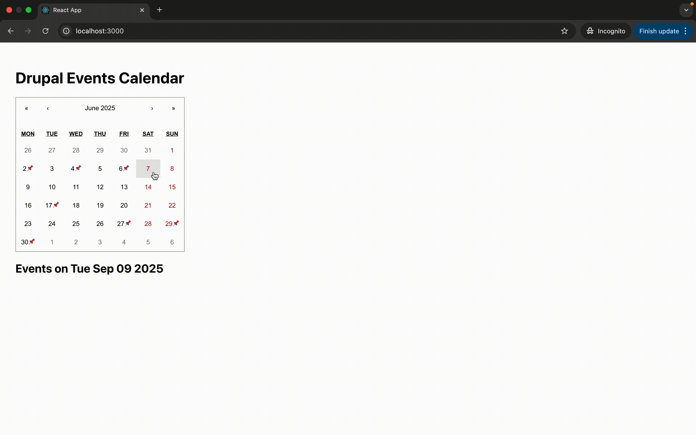

# Drupal + React.js Decoupled Event Calendar

A **Decoupled Drupal + React.js project** that displays events in a **calendar view**.  
The backend is powered by **Drupal JSON:API**, while the frontend is built with **React.js** using Axios and React-Calendar.  

Events created in Drupal (with fields like title, date, and location) are fetched via JSON:API and displayed in the React calendar.  
This setup demonstrates how to build a **headless Drupal application** with a **modern JavaScript frontend**.  

---
## Demo

Here’s how the Decoupled Drupal + React.js Event Calendar works:




---
## 🚀 Features

- **Drupal backend** for structured event content  
- **React.js frontend** to render events in a calendar view  
- Uses **Axios** to fetch events from Drupal JSON:API  
- **React-Calendar** for interactive date picking  
- Events shown with details:  
  - Event **Title**  
  - Event **Date**  
  - Event **Location**

---

## 🛠️ Tech Stack

- **Backend (Drupal 9/10/11):**
  - JSON:API enabled
  - REST & Serialization
  - CORS configured for React
  - Event content type with custom fields

- **Frontend (React.js):**
  - React 18+
  - Axios
  - React-Calendar

---

## 📦 Installation & Setup

### 1️⃣ Backend (Drupal)
1. Install Drupal (9, 10, or 11) and enable required modules:
   - `jsonapi`
   - `rest`
   - `serialization`
   - (optional) `jsonapi_extras`
2. Create an **Event** content type with fields:
   - `field_date` (Date or DateTime field)
   - `field_location` (Text field)
3. Configure **CORS** (in `services.yml` or CORS module):
   ```yaml
   cors.config:
     enabled: true
     allowedOrigins: ['http://localhost:3000']
     allowedHeaders: ['Authorization', 'Content-Type']
     allowedMethods: ['GET', 'OPTIONS']
     exposedHeaders: true
     maxAge: 1000
     supportsCredentials: false
